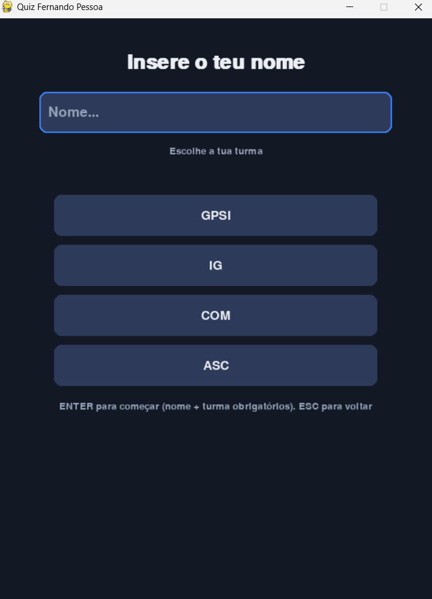
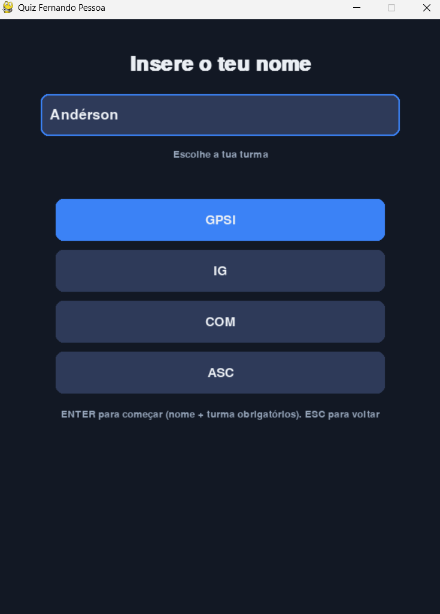

# Quiz Fernando Pessoa (Pygame + MySQL)

<p align="center">
  
</p>


[](https://opensource.org/licenses/MIT)


## Descrição
Projeto educativo de um quiz sobre Fernando Pessoa, desenvolvido em Python com interface gráfica em **Pygame** e persistência de dados em **MySQL**. O utilizador pode registar-se, responder a perguntas, guardar respostas e consultar um leaderboard.

---

## Demonstração do Jogo

1. **Menu Principal**  
Interface inicial do quiz, onde o utilizador pode iniciar o jogo ou aceder ao leaderboard.  


---

2. **Leaderboard**  
Mostra as melhores pontuações registadas pelos utilizadores.  


---

3. **Criação de Utilizador**  
Permite criar um novo utilizador, inserindo o nome e a turma.  



---

4. **Criação de Utilizador com Informação**  
Confirmação do registo com os detalhes do utilizador preenchidos.  



---

5. **Perguntas e Respostas**  
Apresenta uma pergunta com múltiplas opções de resposta ao utilizador.  


---

6. **Perguntas Respondidas**  
Mostra as respostas já selecionadas pelo utilizador durante o quiz.  


---

7. **Fim de Jogo**  
Apresenta a pontuação final do utilizador após completar o quiz.


---

## Funcionalidades
- Ecrã de menu, registo de utilizador (nome + turma) e jogo de perguntas.  
- Perguntas e opções carregadas a partir da base de dados MySQL.  
- Gravação de respostas e pontuações.  
- Leaderboard com as melhores pontuações.  
- Estrutura modular: `src/` para código, `assets/` para recursos, `sql/` para scripts SQL.

---

## Estrutura do projeto

```
quiz-fernando-pessoa/
│
├─ assets/
│ ├─ app/ → Imagens e vídeos do jogo a funcionar
│ ├─ bd/ → Imagens das tabelas da base de dados
│ ├─ diagramas/ → Diagramas da lógica da BD
│ ├─ perguntas/ → Perguntas utilizadas no jogo
│
├─ docs/ → Documentação e apresentação do jogo
│
├─ src/
│ ├─ config.py → Configurações gerais do programa
│ ├─ db.py → Conexão e operações com MySQL
│ ├─ quiz.py → Lógica do jogo
│ ├─ run.py → Ponto de entrada da aplicação
│ ├─ ui.py → Interface gráfica
│
├─ sql/
│ ├─ sql.sql → Criação da base de dados
│ └─ insert.sql → Inserção de perguntas e dados iniciais
│
├─ README.md
└─ requirements.txt
```

---

## Pré-requisitos
- Python 3.10+ (recomendado)  
- MySQL Server (ou MariaDB) instalado e em execução  
- Pip

---

## Instalação e Execução

1. **Clonar o repositório:**
```bash
git clone https://github.com/AndersonBrit/quiz-fernando-pessoa.git
cd quiz-fernando-pessoa
```
2. **Instalar dependências:**
```bash
pip install -r requirements.txt
```

3. **Configurar a base de dados MySQL:**
```sql
source sql/sql.sql;
source sql/insert.sql;
```
Certifica-te de atualizar `src/config.py` com as tuas credenciais do MySQL.

4. **Executar o jogo:**
```bash
python src/run.py
```

---


## Notas
Este projeto foi desenvolvido para fins educativos no âmbito da disciplina de PSI junto da disciplina de Português.

---

## Autoria

Projeto desenvolvido no âmbito do curso profissional de  
**Gestão e Programação de Sistemas Informáticos (GPSI)**

**Escola:** Escola Profissional Bento Jesus Caraça (EPBJC)  
**Disciplina:** PSI  
**Autor:** Andérson Brito"

---

## Licença
Este projeto está licenciado sob a Licença MIT. Veja o ficheiro [LICENSE](LICENSE) para mais detalhes.
